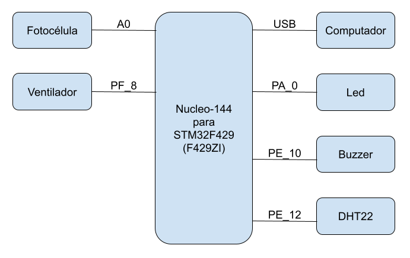

# Proyecto final integrador de Introducción a los sistemas embebidos
Claudio Omar Biale

# Introducción

Desarrollar un sistema que controle: temperatura ambiente, humedad ambiente y luminosidad.

Si se detecta oscuridad se deben activar una serie de leds, cuando exista luminosidad se deben apagar los leds.

Si el nivel de temperatura es mayor a **X** grados centígrados se debe activar un motor que va a simular un ventilador o en su defecto un ventilador de PC. Si la temperatura llega a **Y** grados centígrados se debe apagar el mismo *(X e Y por ahora definidos en código)*.

El objetivo es simular el comportamiento de un invernadero mediante un esquema controlado de temperatura y luminosidad incompleto dado que no se tiene en cuenta el sistema de calor para el cual se podría usar un ventilador que irradie calor.

## Componentes

- 1 (una) placa Nucleo-144 para STM32F429 (F429ZI)
- 1 (un) cable USB
- 1 (una) fuente de 12v
- 1 (un) sensor DHT22
- 1 (un) buzzer
- 1 (un) led
- 1 (una) fotocélula
- 1 (un) ventilador de PC de 12v
- 1 (un) relay *(mosfet dejo de funcionar, en si no comprendo porque funcionaba si los pines dan un voltage de 3v y el mosfet por lo que he leido no "satura" con ese voltaje)*
- 2 (dos) resistencias (una para DHT22 y otra para fotocélula) 

## Diagrama de bloques

## Video de demostración

[Enlace a video](https://youtu.be/RvUnlnfcPi0)

## Propuesta modificada

La propuesta modificada Se puede acceder a la propuesta modificada en el siguiente [enlace](anexos/ISE%20-%20propuesta%20modificada.pdf). 

## Licencia

MIT
